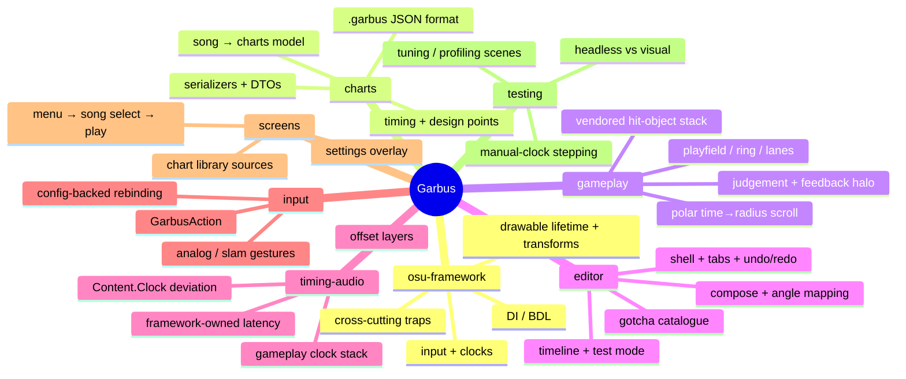

# Garbus — agent onboarding

A standalone rhythm game built directly on **osu-framework** (no osu.Game dependency): hit objects
spawn at the centre of a circular playfield and travel outward toward the ring, where they are judged
at the edge in time with the music.

This is an experimental project and backwards compatibility will NEVER matter until this line is removed. Do not add historical context to documentation, do not add compatibility layers if a schema changes, and do not increment version numbers on anything. There are no garbus charts in existence yet so compatibility does not matter.

This repo's integration branch is master.

**Start with the domain doc for the area you're working in** (index below), and update it as work
lands. Each domain doc is self-sufficient: it covers the local code, the osu-framework background that
area leans on, and its gotchas.

## Build / run / test

- **Build:** `dotnet build Garbus.Desktop.slnf` (the iOS slnf needs a workload not installed here)
- **Run:** `dotnet run --project Garbus.Desktop`
- **Tests:** `dotnet test Garbus.Game.Tests\Garbus.Game.Tests.csproj` (headless NUnit over visual test
  scenes), or run `Garbus.Game.Tests` directly for the visual test browser
- **Runtime logs:** `%APPDATA%\Garbus\logs\*.runtime.log` (config lives at `%APPDATA%\Garbus\garbus.ini`)
- **Reference source (optional):** `git submodule update --init` populates `docs/code-reference/`
  with the osu-framework (`2026.629.0`) and osu (`2026.621.0`) source for local lookup. Not needed to
  build or run — it is never compiled.

## Rules

- **No historical context in docs.** Write present-tense; no project-history framing, no phase
  numbers, no version bumps (see the experimental-project paragraph above).
- **Update the relevant domain doc as work lands** — keep this knowledge base current, it is the
  primary agent context.
- **Vendored osu.Game files keep their ppy MIT attribution header.** Vendor faithfully; deviate
  minimally and note why. Read the original in `docs/code-reference/osu` first.
- *(Reserved for enforced behavioral rules — see `new-agents-md-wishlist.txt` in the repo root: tuning
  tests for new visual features, no test warnings, run formatters, never run the app unasked, no
  ordering-dependent tests. Not yet wired up.)*

## Conventions

- Nullability is enabled solution-wide. DI-resolved / BDL-initialised fields use `= null!`.
- Terminology: osu's "beatmap" is a **chart** here.
- Deliberately dropped (design facts, not omissions): no mods, no difficulty calculation, no replays,
  no skinning, no realm.

## Repo mind map

## Doc index

| Doc | Read when… |
|---|---|
| [docs/agents/osu-framework.md](docs/agents/osu-framework.md) | Touching anything — DI, drawables, input, clocks, and the four cross-cutting traps. |
| [docs/agents/charts.md](docs/agents/charts.md) | Working with the song/chart model, the `.garbus` format, or serialization. |
| [docs/agents/gameplay.md](docs/agents/gameplay.md) | Working on the playfield, scrolling, hit objects, or judgement. |
| [docs/agents/editor.md](docs/agents/editor.md) | Working in `Edit/` — compose, timeline, blueprints, undo/redo. |
| [docs/agents/timing-audio.md](docs/agents/timing-audio.md) | Touching clocks, offsets, latency, or hitsounds. |
| [docs/agents/input.md](docs/agents/input.md) | Working on actions, key bindings, or analog/slam input. |
| [docs/agents/screens.md](docs/agents/screens.md) | Working on the menu, song select, play loop, or settings. |
| [docs/agents/testing.md](docs/agents/testing.md) | Writing or debugging tests. |
| [docs/rules-specs/Judgement.md](docs/rules-specs/Judgement.md) | The authoritative judgement rules (windows, note-lock, slam/slider grading). |
| [docs/rules-specs/Inputs.md](docs/rules-specs/Inputs.md) | The authoritative input rules. |
| [docs/rules-specs/Charts.md](docs/rules-specs/Charts.md) | The authoritative chart-content rules. |
| [docs/charting-specs/LevelRules.md](docs/charting-specs/LevelRules.md) | Level/charting design rules. |
| [docs/presentation-specs/Playfield.md](docs/presentation-specs/Playfield.md) | Playfield presentation spec. |
| [docs/presentation-specs/ObjectStacking.md](docs/presentation-specs/ObjectStacking.md) | Object-stacking presentation spec. |

Per-feature design history lives under `docs/superpowers/` and is not part of this index — the domain
docs above are self-sufficient.
