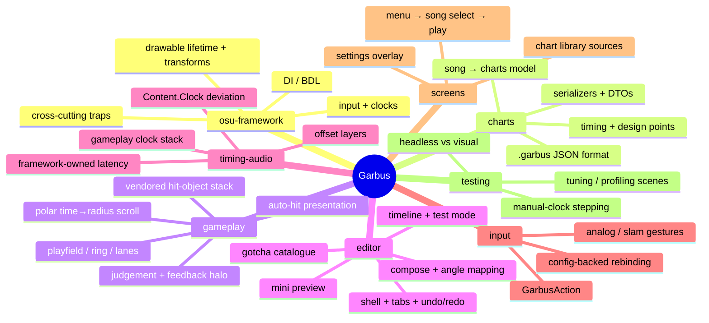

# Garbus — agent onboarding

A standalone rhythm game built directly on **osu-framework** (no osu.Game dependency): hit objects
spawn at the centre of a circular playfield and travel outward toward the ring, where they are judged
at the edge in time with the music.

This is an experimental project and backwards compatibility will NEVER matter until this line is removed. Do not add historical context to documentation, do not add compatibility layers if a schema changes, and do not increment version numbers on anything. There are no garbus charts in existence yet so compatibility does not matter.

This repo's integration branch is master.

**Start with the domain doc for the area you're working in** (index below), and update it as work
lands. Each domain doc is self-sufficient: it covers the local code, the osu-framework background that
area leans on, and its gotchas.

## Build / run / test

- **Build:** `dotnet build Garbus.Desktop.slnf` (the iOS slnf needs a workload not installed here)
- **Run:** `dotnet run --project Garbus.Desktop`
- **Tests:** `dotnet test Garbus.Game.Tests\Garbus.Game.Tests.csproj` (headless NUnit over visual test
  scenes), or run `Garbus.Game.Tests` directly for the visual test browser
- **Runtime logs:** `%APPDATA%\Garbus\logs\*.runtime.log` (config lives at `%APPDATA%\Garbus\garbus.ini`)
- **Reference source (optional):** `git submodule update --init` populates `docs/code-reference/`
  with the osu-framework (`2026.629.0`) and osu (`2026.621.0`) source for local lookup. Not needed to
  build or run — it is never compiled.

## Rules

- **No historical context in docs.** Write present-tense; no project-history framing, no phase
  numbers, no version bumps (see the experimental-project paragraph above).
- **Update the relevant domain doc as work lands** — keep this knowledge base current, it is the
  primary agent context.
- **Vendored osu.Game files keep their ppy MIT attribution header.** Vendor faithfully; deviate
  minimally and note why. Read the original in `docs/code-reference/osu` first.
- **New visual elements ship with a Tuning test.** When you add or reshape a visual element, create a
  Tuning scene (`Garbus.Game.Tests/Tuning/`) that exposes its configurable parameters as live test
  controls — sliders, checkboxes, dropdowns — so the look can be tuned and eyeballed in the visual
  test browser. See [testing.md](docs/agents/testing.md).
- **Do not add new warnings — including in tests.** Build and test output stays warning-clean; fix
  what you introduce before considering the work done.
- **Test expectations are independent and spec-anchored.** Pinned constants trace to a spec doc or a
  commented calibration anchor; expected values are hand-derived, never computed with the
  implementation's own constants or functions; no test may be a strict subset of a sibling; bare
  styling values (colours, glyph icons, alphas, layout offsets) are never asserted — assert relations
  instead. Details in [testing.md](docs/agents/testing.md).
- **UI tests locate drawables by `Name`.** A drawable a test needs to reach sets `Name` to a
  role-describing string literal in its constructor, and the test matches that literal. No name constants
  on production types. Never widen a production type's visibility, index into a container, or match
  on glyph/colour/label copy to find an element. Details in [testing.md](docs/agents/testing.md).
- **Do not run the app unless asked.** Tests (headless and visual scenes) are how you verify. If you
  believe actually running the app would be more effective, ask first and say why.
- **Temporary debugging instrumentation does not get a PR.** Profiling hooks, A/B experiments,
  bypassed effects and other throwaway diagnostics exist to answer one question, then get deleted —
  they are never merged. Leave them on a local branch or worktree and say where it is; do not push
  the branch or open a PR. Only changes meant to land on master get one. When a diagnostic confirms
  a real fix, that fix is separate work and follows the normal flow.
- Current song content (charts, song audio files, jackets) is ephemeral and not final. Do not write
  tests that rely on those files; instead, utilize existing `test-song` audio files or create new 
  ones.

## Conventions

- Nullability is enabled solution-wide. DI-resolved / BDL-initialised fields use `= null!`.
- Terminology: osu's "beatmap" is a **chart** here.

## Repo mind map

## Doc index

| Doc | Read when… |
| --- | --- |
| [docs/agents/osu-framework.md](docs/agents/osu-framework.md) | Touching anything — DI, drawables, input, clocks, and cross-cutting traps. |
| [docs/agents/charts.md](docs/agents/charts.md) | Working with the song/chart model, the `.garbus` format, or serialization. |
| [docs/agents/gameplay.md](docs/agents/gameplay.md) | Working on the playfield, scrolling, hit objects, or judgement. |
| [docs/agents/editor.md](docs/agents/editor.md) | Working in `Edit/` — compose, timeline, blueprints, undo/redo. |
| [docs/agents/timing-audio.md](docs/agents/timing-audio.md) | Touching clocks, offsets, latency, or hitsounds. |
| [docs/agents/input.md](docs/agents/input.md) | Working on actions, key bindings, or analog/slam input. |
| [docs/agents/screens.md](docs/agents/screens.md) | Working on the menu, song select, play loop, or settings. |
| [docs/agents/testing.md](docs/agents/testing.md) | Writing or debugging tests. |
| [docs/rules-specs/Judgement.md](docs/rules-specs/Judgement.md) | The authoritative judgement rules (windows, note-lock, slam/slider grading). |
| [docs/rules-specs/Inputs.md](docs/rules-specs/Inputs.md) | The authoritative input rules. |
| [docs/rules-specs/Charts.md](docs/rules-specs/Charts.md) | The authoritative chart-content rules. |
| [docs/charting-specs/LevelRules.md](docs/charting-specs/LevelRules.md) | Level/charting design rules. |
| [docs/presentation-specs/Playfield.md](docs/presentation-specs/Playfield.md) | Playfield presentation spec. |
| [docs/presentation-specs/ObjectStacking.md](docs/presentation-specs/ObjectStacking.md) | Object-stacking presentation spec. |

The domain docs above are self-sufficient — read the one for the area you're working in.
