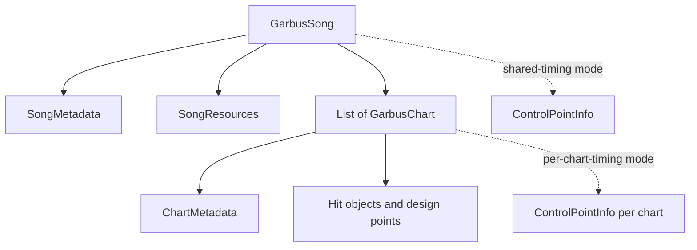

# Song-owned chart storage — imperative design specification

## Status and proposed decisions

Treat this document as an implementation contract once the proposed decisions below are confirmed.

- Persist one song per `.garbus` file. Embed every chart for that song in the same file.
- Require every song to contain at least one chart.
- Let timing use exactly one ownership mode per song: shared song timing or per-chart timing. Do not
  mix shared and chart-local timing within one song.
- Move preview time to the song. Remove the current `Tags` field because it is not part of
  `docs/rules-specs/Charts.md`.
- Make version 2 the only write format. Accept version 1 files as a one-way import, convert them to
  one-chart songs in memory, and write version 2 the next time they are saved.

## Goal

Replace the current model, in which each `GarbusChart` duplicates song metadata and resource paths,
with a `GarbusSong` aggregate that owns shared song data and contains one or more charts. Make the
editor edit the aggregate, make Setup select the active chart, and make song select discover songs
directly instead of inferring them from folders.

## Required ownership model

Create a `GarbusSong` aggregate and make it the root object passed to persistence, editing, song
selection, and resource resolution.



Give `GarbusSong` these members:

- `Guid SongId`
- `SongMetadata Metadata`
- `SongResources Resources`
- `double? PreviewTime`
- `ControlPointInfo? ControlPointInfo`
- `List<GarbusChart> Charts`

Generate `SongId` when a song is created, serialize it, and treat it as immutable logical identity.
Require it to be non-empty. Do not derive ordinary version 2 song IDs from metadata, resource paths,
or file locations, and do not expose the ID in Setup.

Give `SongMetadata` exactly the detail metadata defined by `docs/rules-specs/Charts.md`:

- `Title`
- `Artist`
- `TitleRomanized`
- `ArtistRomanized`
- `Source`

Give `SongResources` exactly the resource metadata defined by that rules document:

- `Track`, containing the relative path to the audio file
- `Background`, containing the relative path to the image file

Keep resource paths relative to the directory containing the `.garbus` song file. Do not duplicate
resource paths inside charts.

Reduce `ChartMetadata` to chart-specific fields:

- `ChartName`
- `Charter`
- `Level`
- `Difficulty`

Give each `GarbusChart` these members:

- A serialized, immutable `Guid ChartId` generated when the chart is created
- `ChartMetadata Metadata`
- `ControlPointInfo? ControlPointInfo`
- `DesignPointInfo DesignPointInfo`
- `List<GarbusHitObject> HitObjects`

Use `ChartId` as editor selection identity and as the song-select locator within a song file. Require
IDs to be non-empty and unique within the song. Do not expose the ID in Setup.

Remove `Title`, `Artist`, romanized variants, `Source`, `Tags`, `AudioFile`, and `BackgroundFile` from
`ChartMetadata`. Remove `PreviewTime` from `GarbusChart`.

## Timing ownership

Represent timing ownership by nullability, not by duplicated data or an independent boolean:

- When `GarbusSong.ControlPointInfo` is non-null, treat it as shared timing and require every
  `GarbusChart.ControlPointInfo` to be null.
- When `GarbusSong.ControlPointInfo` is null, require every chart to have a non-null
  `GarbusChart.ControlPointInfo` and use the active chart's timing.

Allow a present `ControlPointInfo` to contain zero points so an incomplete work-in-progress song can
still be saved. Keep the editor's new-song default of one point at 0 ms and 120 BPM.

Add one timing-ownership control to the Song column in Setup:

- Label the choices `Shared song timing` and `Per-chart timing`.
- Default new songs to `Shared song timing`.
- When changing from per-chart to shared timing, copy the active chart's timing into the song and
  set every chart-local timing property to null. Require confirmation when the chart timing collections
  are not identical.
- When changing from shared to per-chart timing, deep-copy the song timing into every chart, then
  set the song timing property to null.
- Apply the conversion as one undoable transaction.

Expose one `EffectiveControlPointInfo` for the active chart. Resolve it from the song in shared mode
and from the active chart in per-chart mode. Make Compose, Timing, the editor clock, beat snapping,
the top timeline, the bottom bar, Design, Verify, and test mode consume this effective value rather
than reading `GarbusChart.ControlPointInfo` directly.

When the Timing tab edits shared timing, apply the edit to the song. If `Adjust objects on timing
change` is enabled, adjust affected objects in every chart; if it is disabled, change only the shared
timing grid. When the Timing tab edits per-chart timing, retain the current active-chart behavior.

## Version 2 file format

Replace `ChartFileDto` with a song-root DTO. Encode this conceptual shape using the existing camel-case,
indented JSON conventions:

```json
{
  "version": 2,
  "id": "generated-stable-song-id",
  "metadata": {
    "title": "",
    "artist": "",
    "titleRomanized": "",
    "artistRomanized": "",
    "source": ""
  },
  "resources": {
    "track": "audio.ogg",
    "background": "background.png"
  },
  "previewTime": null,
  "timingPoints": [],
  "charts": [
    {
      "id": "generated-stable-id",
      "metadata": {
        "chartName": "Novice",
        "charter": "",
        "level": 0,
        "difficulty": "Novice"
      },
      "hitObjects": [],
      "designPoints": []
    }
  ]
}
```

Use the song-level `timingPoints` property only for shared timing. Omit it in per-chart mode and write
a `timingPoints` property in every chart instead. Preserve the difference between an omitted property
and an explicitly empty array during decoding.

Reject a file when it violates any structural invariant:

- It does not contain at least one chart.
- It contains a missing or empty song ID.
- It contains a missing or duplicate chart ID.
- It contains both song timing and any chart-local timing.
- It contains neither song timing nor timing for every chart.
- It contains an unknown difficulty or hit-object/design-point discriminator.

### Version 1 conversion

Make the decoder recognize version 1 and convert it into a valid version 2 `GarbusSong`. Do not retain
a version 1 runtime model after decoding.

Map a version 1 chart as follows:

- Create one `GarbusSong` containing one `GarbusChart`.
- Derive the converted song's `SongId` deterministically from the original version 1 JSON bytes.
- Move Title, Artist, Romanised Title, Romanised Artist, and Source into `SongMetadata`, normalizing
  the version 1 `Romanised` spelling to the version 2 `Romanized` property names.
- Move Audio File and Background File into `SongResources.Track` and `SongResources.Background`.
- Move Preview Time onto the song.
- Promote the version 1 timing points to shared song timing and set the converted chart's timing to
  null.
- Keep Charter, Chart Name, Level, and Difficulty in the converted chart's metadata.
- Preserve every hit object and design point without semantic changes.
- Drop version 1 Tags because version 2 has no Tags field.

Derive both converted IDs with one documented SHA-256-to-Guid algorithm and different domain prefixes,
such as `song:` and `chart:`. Repeated scans and loads of identical unsaved version 1 JSON must produce
the same IDs, while its `SongId` and `ChartId` must differ. Preserve both IDs when the converted song
is saved as version 2.

Return conversion status from decode/load. When the editor opens a converted version 1 file, show the
converted song normally, initialize undo history from the converted state, and mark the file dirty so
the normal unsaved-changes protections apply. Do not overwrite the source file merely by opening it.
Write version 2 on Save or Save As and clear the conversion-dirty state only after the write succeeds.

Let song select scan and play version 1 files through the same conversion path. Treat each version 1
file as a one-chart song; do not rewrite library files during a scan or gameplay launch.

Rename `GarbusChartSerializer` to `GarbusSongSerializer`. Keep focused hit-object codecs available for
clipboard and undo identity comparisons. Make `Encode()` operate only on complete version 2 songs and
make `Decode()` return a complete song plus whether version 1 conversion occurred.

Replace `ChartFile` with `SongFile`. Make it own a `GarbusSong`, the `.garbus` path, the resource
directory, and cached stores. Rename its resource APIs to describe the song rather than the chart.
Resolve track and background exclusively through `Song.Resources`.

Make Save and Save As write the entire song atomically. Write to a temporary sibling file and replace
the destination only after serialization succeeds. When Save As changes directories, copy the current
track and background into the destination before switching the resource root; never leave the newly
saved song pointing at missing resources.

## Editor aggregate and active-chart lifecycle

Replace the editor's chart-root session with a song-root session:

- Make `GarbusEditor` accept a `SongFile`.
- Add an `EditorSong` component that owns the `GarbusSong`, exposes the active `ChartId`, and performs
  add, remove, select, timing-mode conversion, and song-level mutations.
- Keep `EditorChart` as the active-chart editing facade. Make it rebind when `EditorSong.ActiveChart`
  changes instead of constructing a second editor screen.
- Expose active-chart and effective-timing changes as bindable state/events.
- Stop caching a raw `ControlPointInfo` instance in dependency injection. Cache a provider or bindable
  reference that every timing consumer can rebind to.

On active-chart selection:

1. Commit or cancel the currently focused Setup text edit before changing selection.
2. Stop playback.
3. Clear selected hit objects and selected design/timing points.
4. Bind `EditorChart` to the selected chart.
5. Rebind the editor clock and all timing consumers to `EffectiveControlPointInfo`.
6. Preserve the playhead time when possible and clamp it to the track range.
7. Rebuild chart-specific compose, design, timeline, and verify state.

Keep one undo/redo history for the whole song. Snapshot the complete `GarbusSong`, not only the active
chart. Make song metadata changes, resource-path changes, chart additions/removals, timing ownership
conversions, and chart edits undoable. Restore the active chart by `ChartId` after undo/redo; when that
ID no longer exists, select the nearest surviving chart.

Treat ordinary chart selection as navigation. Do not serialize it, add it to undo history, or mark the
song dirty.

Compute dirty state from the serialized whole-song snapshot. Mark the song clean only after a
successful complete-file save.

## Setup tab

Replace the single vertical Setup form with a two-column `GridContainer`. Keep a shared overlay above
both columns for file selectors and confirmation dialogs.

Build the left `Song` column in this order:

1. Render a `Song` heading.
2. Render editable rows for Title, Romanized Title, Artist, Romanized Artist, and Source.
3. Render resource chooser rows for Track and Background.
4. Render the timing-ownership control.
5. Render a `Charts` list view.
6. Render Add and Remove buttons directly below the list.

Make every song metadata commit one undo step. Make resource imports copy into the song directory,
update `Song.Resources`, and reload the shared track/background consumers. Disable resource pickers
until the song has been saved once and show `Save the song first to add resources.`

Populate the Charts list from `Song.Charts` in serialized order. Display each row as the explicit
chart name when present, otherwise the difficulty name; append `Lv.N` when level is greater than zero.
Highlight the active chart and route both mouse and keyboard selection through `EditorSong`.

Make Add perform one undoable transaction:

- Generate a new unique `ChartId`.
- Create empty chart metadata with `Difficulty.Novice` and level 0.
- Create empty hit-object and design-point collections.
- In shared-timing mode, leave chart timing null.
- In per-chart mode, deep-copy timing from the previously active chart.
- Append the chart and select it.

Make Remove perform one undoable transaction. Disable it while only one chart remains. Require
confirmation before removing a chart that has any hit objects or design points. After removal, select
the row that took the removed row's index, or the preceding row when the removed chart was last.

Build the right `Chart` column in this order:

1. Render a `Chart` heading.
2. Render editable rows for Chart Name and Charter.
3. Render the numeric Level row.
4. Render the Difficulty dropdown.

Bind the right column to the active chart and refresh it immediately after Add, Remove, selection,
undo, or redo. Do not display song-owned values in the Chart column.

Make both columns independently scroll when their content exceeds the available height. Give the
Charts list the remaining vertical space in the Song column rather than allowing it to grow without
bound.

## File menu and resource behavior

Change editor terminology from chart files to songs where the command acts on the aggregate:

- `New` creates a new song with one empty chart and shared default timing.
- `Open…` opens one `.garbus` song file.
- `Save` and `Save As…` save the entire song.
- Default Save As names derive from the song title and fall back to `new-song.garbus`.
- Exit prompts refer to unsaved song changes.

Keep the audio clock alive across chart switches because all charts use the same song track. Reload it
only when the track resource or song file directory changes.

Move `Set preview point to current time` to song ownership. Keep it available regardless of which
chart is active and make the change undoable.

## Song select and gameplay

Stop grouping independent `.garbus` files by containing directory. Treat each `.garbus` file as one
song and produce one `SongGroup` directly from its song metadata.

Carry `SongId` on the song-select model as logical identity, but keep the source and physical song-file
locator as the loading identity. If two discovered files contain the same `SongId`, report the duplicate
and keep their locators distinct; do not silently merge them or choose one based only on UUID.

Produce one `ChartCard` for every embedded chart. Give every card a locator composed of its source,
song-file locator, and `ChartId`. Populate title, artist, preview time, track, and background from the
song; populate chart name, level, difficulty, and charter from the chart.

Sort charts within a song by level and preserve current song-title sorting across songs. Ensure flat
view still produces one row per embedded chart.

On launch, load the song once, resolve the requested chart by `ChartId`, resolve effective timing,
and pass a playable chart context containing both song-owned and chart-owned data into gameplay.
Apply hit-object defaults only to the selected chart. Resolve audio and background from the song file's
directory.

Update bundled-resource discovery to enumerate song files and their embedded charts. Keep the bundled
developer test fixture hidden using its song-file locator, not a chart locator.

## Verification

Run song-owned checks once per song:

- Track resource is set and exists.
- Background resource is set and exists.
- At least one chart exists.
- Timing ownership is structurally valid.

Run chart-owned checks against the active chart unless Verify explicitly presents an all-chart
summary:

- Objects before time 0.
- Objects beyond the shared track end.
- Difficulty-specific charting restrictions.

Include the chart display name in any all-chart issue row and select that chart before seeking to the
issue time.

## Required tests

Add or update unit tests to prove:

- Version 2 shared-timing and per-chart-timing files round-trip without changing ownership.
- New songs and charts receive non-empty IDs, and separately created songs receive different
  `SongId` values.
- Version 1 decoding maps every song field, resource, preview time, timing point, chart field, hit
  object, and design point to the specified version 2 owner.
- Repeated conversion of identical version 1 JSON produces the same `SongId` and `ChartId`, and the
  two domain-separated IDs differ from each other.
- Opening version 1 marks the editor dirty, does not rewrite the source, and Save emits version 2.
- Song select discovers and launches a version 1 file as a converted one-chart song without rewriting
  it.
- The serializer rejects a missing/empty song ID, every invalid timing-ownership combination, and
  duplicate/missing chart IDs.
- Song metadata/resources appear once in encoded JSON and never inside chart entries.
- A song with multiple charts round-trips hit objects, design points, and chart metadata independently.
- `SongFile` imports shared resources, reloads the shared track, and preserves resources across Save As.
- Add, remove, and selection follow the Setup rules, including the one-chart minimum.
- Switching charts rebinds Compose, Timing, Design, timeline, clock, and Verify to the selected chart.
- Shared timing edits affect every chart's effective timing; per-chart edits affect only the active
  chart.
- Timing-mode conversion deep-copies data and is reversible through undo/redo.
- Whole-song dirty tracking covers both song and chart mutations.
- Song select emits one group per song file and one card per embedded chart.
- A card loads the chart matching its `ChartId` and uses song-owned preview/resources.
- Test mode launches the active chart with the song track and effective timing.

Update visual editor coverage to assert the two-column Setup layout, song field placement, chart field
placement, list selection, Add, Remove, and empty/confirmation states.

Regenerate bundled `.garbus` fixtures as version 2 song files and update all test generators and test
helpers to create a `GarbusSong` with at least one chart.

## Completion criteria

Call the architecture change complete only when:

- No production code reads song-owned metadata or resources from `ChartMetadata`.
- No production code infers song identity by grouping chart files by directory.
- Every newly written song has a non-empty, stable `SongId` independent of its path and metadata.
- No editor timing consumer retains a stale `ControlPointInfo` after chart selection or ownership-mode
  conversion.
- One saved song file can contain, edit, select, save, discover, preview, and play at least two charts
  without duplicating song metadata or resources.
- A version 1 chart can be opened, converted without losing supported data, and saved as version 2.
- The full automated test suite passes with version 2 fixtures.

## Out of scope

- Do not add independent audio or background resources per chart.
- Do not allow a chart to override shared timing while other charts inherit it.
- Do not add chart reordering, duplication, import, or cross-song copy in this change.
- Do not add multiple backgrounds, storyboard resources, video, or per-chart preview points.
- Do not write version 1 files or provide a downgrade path from version 2.
